# Welcome to My GitHub Portfolio

I am a passionate and results-driven Data Scientist and Analyst with a strong foundation in data management, statistical analysis, and machine learning. I have a Master's Degree in Data Science and a Graduate Certificate in Biostatistics. My academic background in research has provided me with a solid understanding of data science principles, while my hands-on experience in analyzing complex datasets, developing models, and creating actionable insights has honed my ability to solve real-world problems.

With expertise in Python, R, and other analytical tools, I have worked on a wide range of projects, from exploratory data analysis (EDA) and data visualization to machine learning applications. I have a proven track record of applying advanced algorithms and statistical models to generate meaningful insights, drive decision-making, and deliver impactful results for various stakeholders.

Throughout my career, I have demonstrated my ability to collaborate cross-functionally, manage large datasets, and communicate technical concepts to both technical and non-technical audiences. My dedication to continuous learning and my commitment to staying at the forefront of emerging technologies in data science ensures that I bring innovative solutions to every project I tackle.

## Table of Contents
- [Technologies](#technologies)
- [Project Highlights](#project-highlights)
  - [NACC Dashboards](#nacc-dashboards)
  - [Time Clusters (AD)](#time-clusters-ad)
  - [AutoSRev — Automated Systematic Review](#autosrev--automated-systematic-review)
  - [Earthquake Radiation Analysis](#earthquake-radiation-analysis)
- [Committee Work](#committee-work)
- [Publications](#publications)
- [Contact](#contact)

## Technologies
I have intermediate experience with following technologies:
- **Python**
- **R**
- **SQL**
- **Java**
- **QGIS**
- **Tableau**

## Project Highlights

### [NACC Dashboards](nacc_dashboard/)

I developed a suite of reproducible analytics dashboards designed to support intuitive, multi-level comparison across Alzheimer’s Disease Research Centers (ADRCs), while also enabling within-site and within-subject longitudinal analysis. These dashboards were built to support ongoing monitoring rather than one-off reporting.

**Selected dashboard outputs:**

**Global MOCA vs CDR-SB correlation (all sites)**  
Highlights cross-site consistency and heterogeneity in cognitive measure alignment, supporting assessment of comparability across centers.
  

**Follow-up missingness across all sites**  
Summarizes longitudinal follow-up completeness, enabling rapid identification of sites with elevated attrition or missing data patterns.
  

**Within-site CDR-SB change (initial vs most recent visit)**  
A barbell plot for a selected site comparing subject-level baseline and most recent CDR-SB values, supporting intuitive interpretation of progression, stability, or variability over time.
  

**Full dashboard report:** See the accompanying PDF in this folder for additional figures and methodological details.  

---

### [Time Clusters (AD)](Time_Clusters_AD/)

This project investigates longitudinal patterns of cognitive progression in Alzheimer’s disease using time-aware modeling rather than visit-level prediction. The primary goal was exploratory discovery: identifying latent cognitive states and transition dynamics directly from real-world longitudinal clinical data.

**Data**
The analysis uses the longitudinal National Alzheimer’s Coordinating Center (NACC) Uniform Data Set (UDS), a geographically diverse cohort spanning approximately 2005–2025.

Key characteristics of the dataset include:
- 54,000+ subjects with repeated clinical visits  
- An average of ~3.7 years of follow-up per subject  
- 1,000+ variables capturing cognitive, functional, and clinical information  
- 200,000+ total observations across all visits  
- Roughly balanced representation of cognitively normal and impaired subjects

Diagnostic states were binned into clinically meaningful categories to support downstream modeling. In this phase, the focus is on **latent structure discovery**, not prediction.

**Processing Pipeline**
A substantial preprocessing pipeline was developed to prepare the data for longitudinal sequence modeling, including:
- cleaning of placeholder values and invalid entries  
- handling of longitudinal missingness patterns  
- feature construction for cognitive status and temporal structure  
- exclusion of variables that would trivially encode diagnosis  

The emphasis was on producing a **clean, temporally consistent representation** suitable for unsupervised modeling.

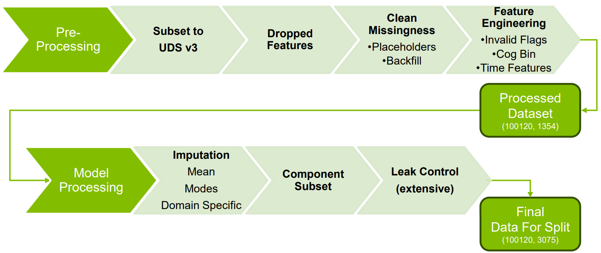

**Latent State Exploration with Hidden Markov Models**
An unsupervised **Hidden Markov Model (HMM)** was used to infer latent cognitive states underlying observed clinical measures. The objective was not classification accuracy, but **structure discovery**: uncovering progression stages and transition behavior implicit in longitudinal data.

Exploration supported a **four-state latent structure**, with each state exhibiting distinct emission profiles and temporal dynamics.

***Emission patterns across latent states:***

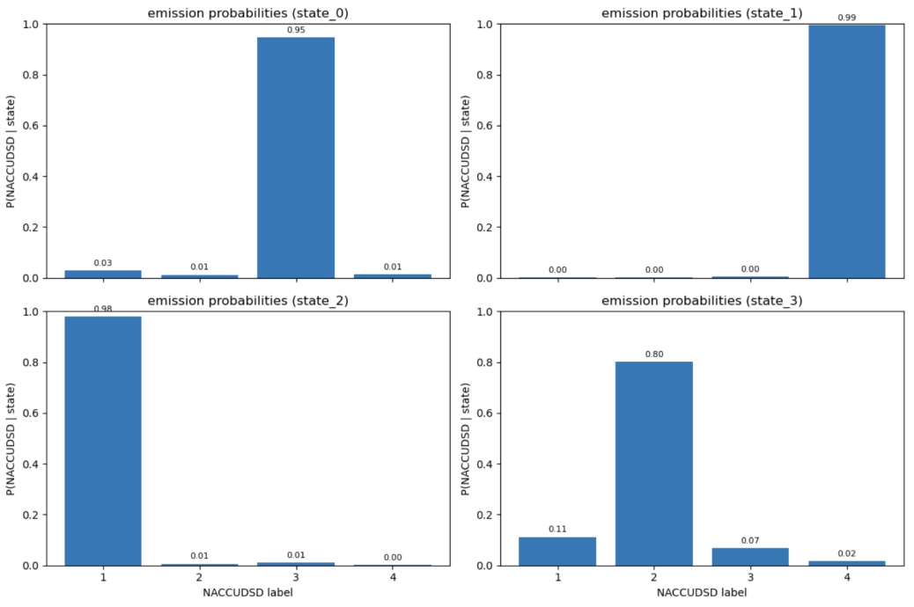

**Transition Dynamics and State Ordering**

Analysis of the learned transition matrix revealed meaningful differences in **state stability and progression likelihood**, distinguishing more persistent states from transitional phases.

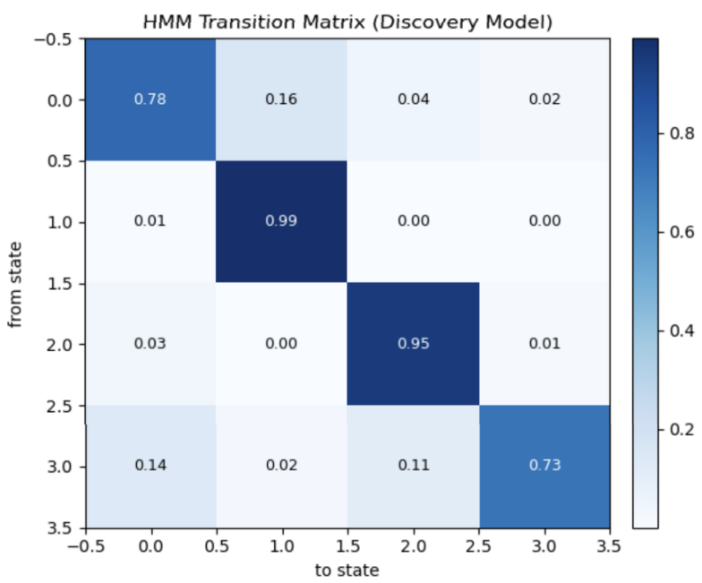

A conceptual ordering of latent states was derived to support interpretation of progression dynamics over time.

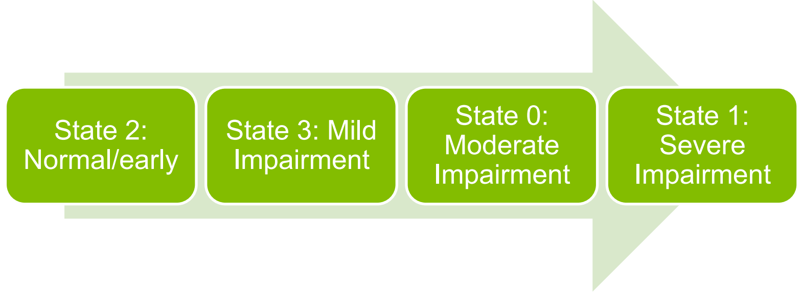

**Latent State Feature Profiles**
Inspection of feature distributions within each latent state revealed clinically interpretable patterns:

- **Normal / Early Impairment (State 2):**  
  Low cardiovascular markers and generally healthy cognitive and functional baselines.

- **Mild Impairment (State 3):**  
  Subtle declines in cognition accompanied by early changes in cardiovascular health, consistent with a transitional stage.

- **Moderate Impairment (State 0):**  
  Increased cardiovascular signals, emerging functional limitations, and distinct declines in cognitive measures.

- **Severe Impairment (State 1):**  
  The largest deviations from population means across multiple features, reflecting widespread impairment.

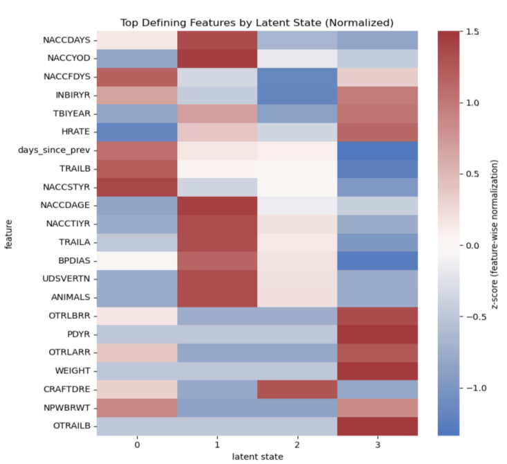

Together, these profiles support the **clinical plausibility** of the discovered latent structure while highlighting the contribution of non-cognitive features to disease characterization.

**Why This Matters**
This work demonstrates how unsupervised time-series models can move beyond static diagnostic labels to uncover progression dynamics directly from longitudinal clinical data. The approach provides a foundation for hypothesis generation, trajectory-based analysis, and future predictive extensions.

**Final project presentation (with co-authors):**  
https://youtu.be/yZVrWwY5-8U

---

### [AutoSRev — Automated Systematic Review](AutoSRev/)

Systematic reviews are foundational to evidence-based medicine, but they are time-intensive, often requiring review of hundreds of publications and taking 3–12 months to complete. AutoSRev is a proof-of-concept pipeline designed to automate key stages of the systematic review process: article discovery, relevance classification, and structured data extraction.

The goal of this project was to evaluate **feasibility**, not full generalizability, and to demonstrate that meaningful automation is possible even with limited labeled data.

**Concept Overview**
AutoSRev:
- identifies potentially relevant publications from a large corpus
- classifies articles based on domain-specific research questions
- extracts structured summary data to support downstream analysis

The system was intentionally scoped to a **limited domain** to validate the approach before generalization.

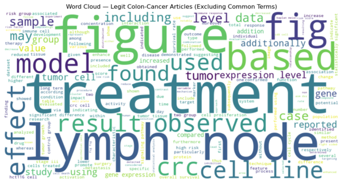

**Preprocessing and Text Representation**
Full-text XML articles were parsed into structured sections, enabling targeted weighting of informative content. Section importance was adjusted dynamically depending on the task stage (retrieval vs extraction).

Key preprocessing steps included:
- parsing full-text XML into standardized sections  
- section-weighting to emphasize abstracts, results, or methods as appropriate  
- lowercasing, stemming, stopword removal, and short-token filtering  

This design allowed the same corpus to support multiple analytic objectives without reprocessing.

**Information Retrieval and Classification**

The pipeline began with a TF-IDF vectorization of the full corpus, followed by cosine similarity ranking between user queries and documents.

To improve robustness with a small labeled dataset, the system evolved from pure cosine-based retrieval to a cosine-informed logistic regression classifier (cosineLR):
- cosine similarity retained as an explicit feature
- additional engineered features added for domain signal
- improved recall for ambiguous abstracts and borderline cases

This hybrid approach preserved semantic similarity while enabling supervised learning.

**Confusion matrices for two target queries:**

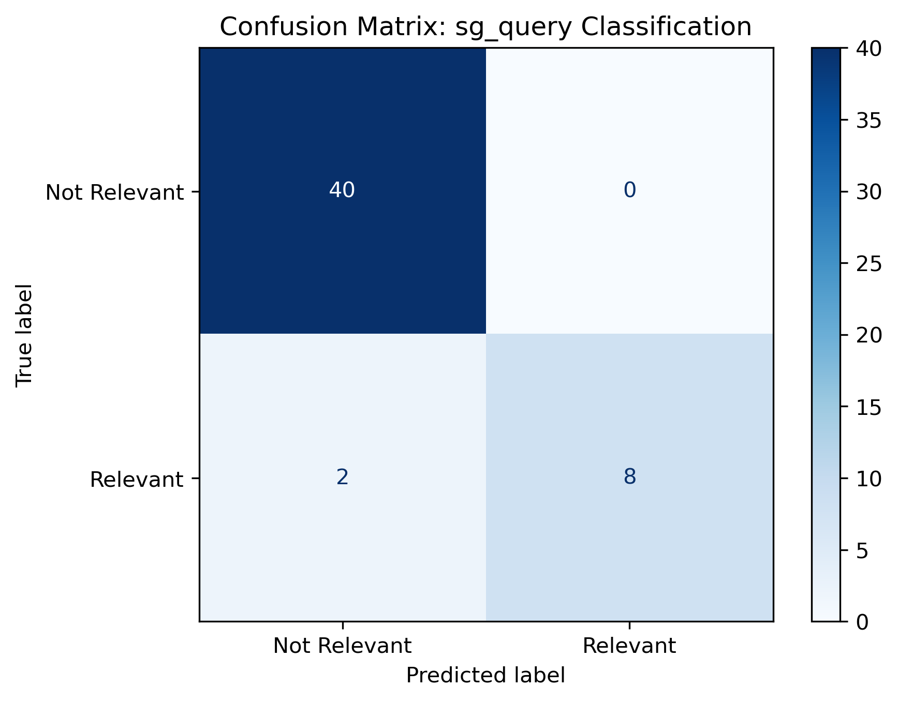

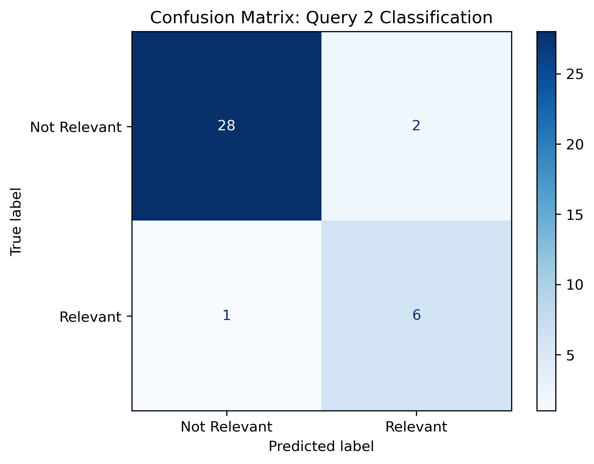

**Cross-validation performance (query 1):**

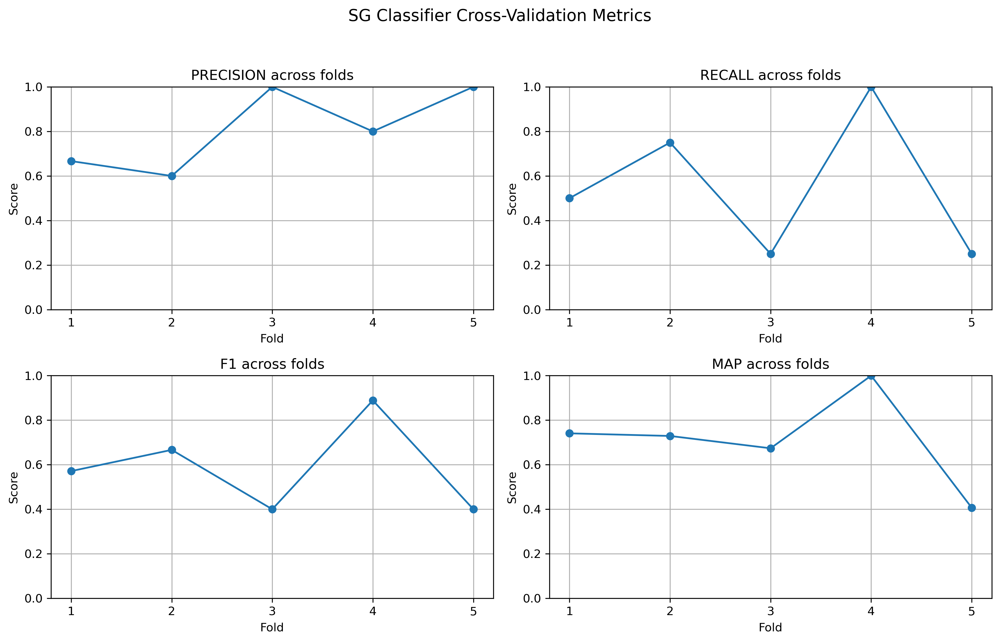

**Descriptive Statistics and Data Extraction**
For articles predicted as relevant, a descriptive statistics module was applied to extract structured study-level information, including:
- sample size  
- sex distribution  
- age  
- BMI  
- study type  

Extraction relied on tuned regular expressions to handle heterogeneous reporting styles. When multiple candidate values were detected, conservative defaults were applied (e.g., sample size defaulted to 1 for case studies).

Missing values were explicitly encoded as `-9999` to preserve analytic integrity.

**Example extracted statistics table:**

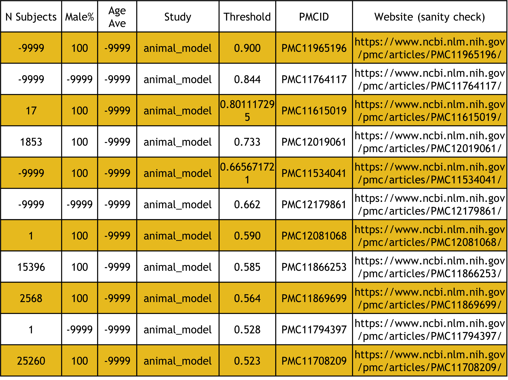

**Domain-Specific Metrics (Prototype)**
Certain domain-specific indicators were implemented as boolean, hardcoded parameters. While effective for the proof-of-concept, these components were intentionally flagged as limiting generalizability, highlighting areas for future refactoring or learning-based approaches.

**Outputs**
- structured `.csv` files containing extracted study-level data  
- ranked article lists for flexible review depth  
- reproducible outputs supporting auditability and downstream analysis  

**Core Findings**
This project demonstrated that:
- an end-to-end automated systematic review pipeline is feasible
- meaningful data extraction can be achieved from predicted articles
- automation has the potential to reduce review timelines by weeks to months
- standardized pipelines can increase data integrity and reproducibility

While limited in scope, AutoSRev provides a strong foundation for expanding automated evidence synthesis in biomedical research.

---

### [Earthquake Radiation Analysis](r-programming/data-visualization/earthquakes_radiation/)

This project analyzes radiation exposure following a **simulated earthquake-related disaster** in the fictional city of *St. Himark*, using the **VAST 2019 Challenge dataset**. The goal was to support **situational awareness and decision-making** under conditions of noisy, conflicting, and heterogeneous sensor data.

**Data Overview**
Radiation measurements were collected over a **five-day period (April 6–10)** following the event and consist of two complementary data sources:

- *Mobile sensors (3.3M+ records):*  
  Citizen scientist devices with high spatial coverage but variable accuracy.

- *Static sensors (744K records):*  
  Fixed, calibrated sensors providing more stable reference measurements.

Each record included:
- timestamp  
- sensor ID  
- longitude and latitude  
- radiation value and units  
- user ID  

Additional engineered features were created, including:
- hour of day  
- date and weekday  
- sensor type (mobile vs static)  

This allowed temporal patterns and sensor reliability differences to be explicitly examined.

**Analytical Objectives**
The analysis focused on:
- addressing uncertainty and disagreement in citizen-reported measurements  
- comparing mobile and static sensor behavior  
- identifying troubled regions requiring intervention  
- examining the spread of contamination over time
- informing potential cleanup and evacuation planning

Rather than treating individual measurements as ground truth, the work emphasized aggregate behavior and consistency across sensors and time.

**Aggregated Trends**
To reconcile conflicting reports, radiation values were aggregated across time and sensor type, enabling comparison of global trends and identification of anomalous periods.

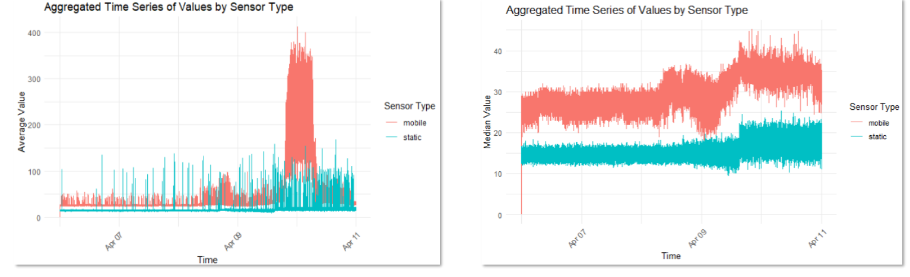

**Spatial–Temporal Visualization**
A central deliverable of this project was an animated map of St. Himark, visualizing radiation levels from both mobile and fixed sensors over time. The animation highlights:
- emerging hotspots  
- spatial diffusion patterns  
- differences between citizen-reported and calibrated measurements  

The animation was created using R visualization and animation libraries, including `ggplot2` and `gganimate`.

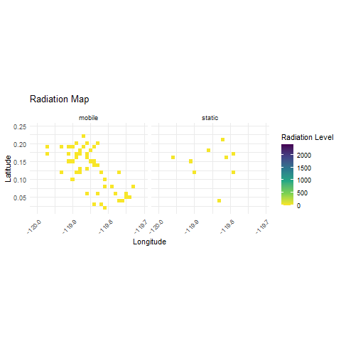

**Why This Matters**
This project demonstrates how **large-scale, noisy sensor data** can be transformed into actionable insight through thoughtful aggregation, temporal analysis, and visual storytelling. It highlights the importance of:
- uncertainty-aware analysis  
- combining heterogeneous data sources  
- communicating complex dynamics clearly to support rapid decision-making

The resulting visualizations are designed to support emergency response, environmental monitoring, and public safety planning in data-limited, high-stakes contexts.
 
---

## Committee Work
Between 2022 and 2024, I worked as a co-chair and leader on the Electronic Data Capture NACC committees. In this role, I helped develop NIH data management plans, psychometric data capture standardization, and data best practices. I worked and led 3 committees over the two years and am incredibly proud of the deliverables we created for our research community.

  - [Link to Committee Website](https://naccdata.org/nacc-collaborations/uds4-updates#collaborations)

---

## Publications
I have published several works in academic journals and conferences. For a full list of my publications, please refer to the [publications list](https://github.com/s-gothard/portfolio/blob/main/Publications/Publications.md).

---

## Contact
Feel free to reach out if you have any questions or would like to discuss collaboration opportunities!

- **Email**: [tyle1239@gmail.com](mailto:tyle1239@gmail.com)
- **LinkedIn**: [My LinkedIn Profile](https://www.linkedin.com/in/sarah-gothard-8972a8124/)

