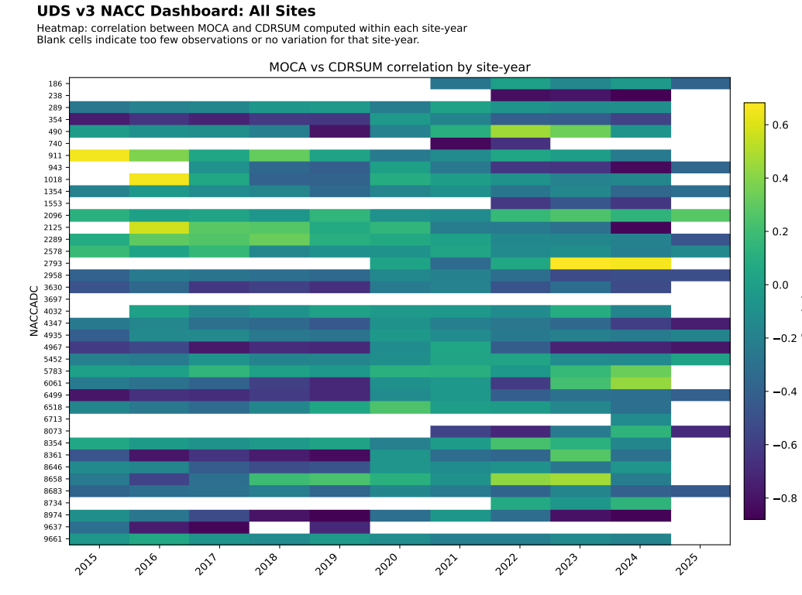
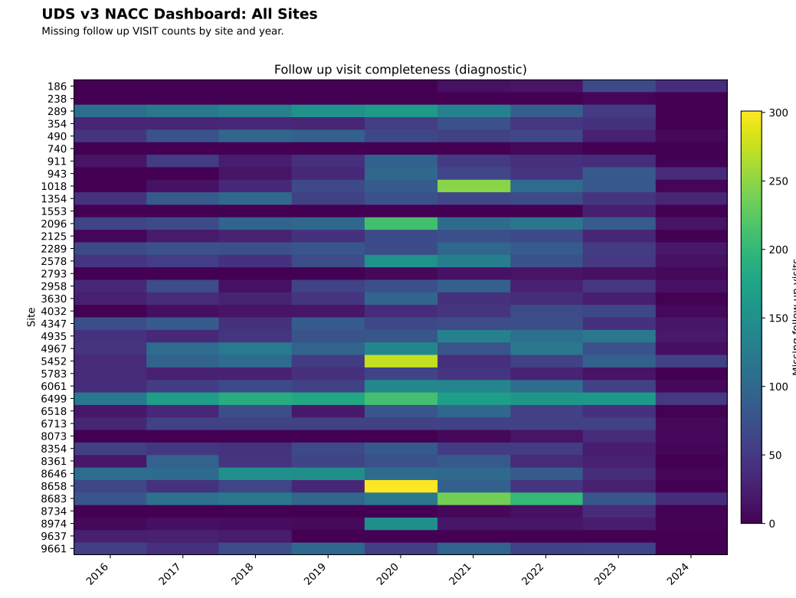
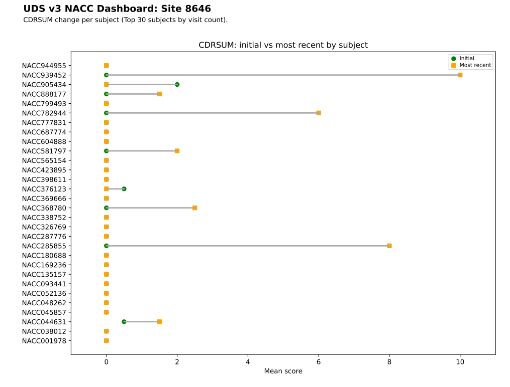

# Welcome to My GitHub Portfolio

I am a passionate and results-driven Data Scientist and Analyst with a strong foundation in data management, statistical analysis, and machine learning. I have a Master's Degree in Data Science and a Graduate Certificate in Biostatistics. My academic background in research has provided me with a solid understanding of data science principles, while my hands-on experience in analyzing complex datasets, developing models, and creating actionable insights has honed my ability to solve real-world problems.

With expertise in Python, R, and other analytical tools, I have worked on a wide range of projects, from exploratory data analysis (EDA) and data visualization to machine learning applications. I have a proven track record of applying advanced algorithms and statistical models to generate meaningful insights, drive decision-making, and deliver impactful results for various stakeholders.

Throughout my career, I have demonstrated my ability to collaborate cross-functionally, manage large datasets, and communicate technical concepts to both technical and non-technical audiences. My dedication to continuous learning and my commitment to staying at the forefront of emerging technologies in data science ensures that I bring innovative solutions to every project I tackle.

## Table of Contents
- [Technologies](#technologies)
- [Projects Highlights](#?)
  - [NACC Dashboards](#?)
  - [Time Clusters D](#?)
  - [AutoSRev](#?)
  - [Lab Utilization Data Visualization](#?)
  - [Earth Quake Radiation Project](#qgis)
- [Committee Work](#committee-work)
- [Publications](#publications)
- [Contact](#contact)

## Technologies
I Have experience with following technologies:
- **Python**
- **R**
- **Java**
- **QGIS**
- **SQL**
- **Tableau**

## Project Highlights

### [NACC Dashboards](nacc_dashboard/)

I developed a suite of reproducible analytics dashboards designed to support intuitive, multi-level comparison across Alzheimer’s Disease Research Centers (ADRCs), while also enabling within-site and within-subject longitudinal analysis. These dashboards were built to be **easily re-run as new data become available**, supporting ongoing monitoring rather than one-off reporting.

Key design principles:
- enable **cross-site benchmarking** in a standardized framework
- support **within-site comparisons** across time
- summarize **subject-level longitudinal change**
- ensure outputs can be **regenerated as data are refreshed**

**Selected dashboard outputs:**

**Global MOCA vs CDR-SB correlation (all sites)**  
Highlights cross-site consistency and heterogeneity in cognitive measure alignment, supporting assessment of comparability across centers.
  

**Follow-up missingness across all sites**  
Summarizes longitudinal follow-up completeness, enabling rapid identification of sites with elevated attrition or missing data patterns.
  

**Within-site CDR-SB change (initial vs most recent visit)**  
A barbell plot for a selected site comparing subject-level baseline and most recent CDR-SB values, supporting intuitive interpretation of progression, stability, or variability over time.
  

📄 **Full dashboard report:** See the accompanying PDF in this folder for additional figures and methodological details.  

### Time Cluster Analysis for Cognitive Decline (Time Clusters AD)
s

### AutoSRev

### Lab Utilization Data Visualization

### Earth Quake Radiation Project
- **Geospatial Data Analysis**  
  [View Project]()  

## Committee Work
Between 2022 and 2024, I worked as a co-chair and leader on the Electronic Data Capture NACC committees. In this role, I helped develop NIH data management plans, psychometric data capture standardization, and data best practices. I worked and led 3 committees over the two years and am incredibly proud of the deliverables we created for our research community.

  - [Link to Committee Website](https://naccdata.org/nacc-collaborations/uds4-updates#collaborations)

## Publications
I have published several works in academic journals and conferences. For a full list of my publications, please refer to the [publications list](https://github.com/s-gothard/portfolio/blob/main/Publications/Publications.md).

## Contact
Feel free to reach out if you have any questions or would like to discuss collaboration opportunities!

- **Email**: [tyle1239@gmail.com](mailto:tyle1239@gmail.com)
- **LinkedIn**: [My LinkedIn Profile](https://www.linkedin.com/in/sarah-gothard-8972a8124/)

---

Thank you for checking out my portfolio!
